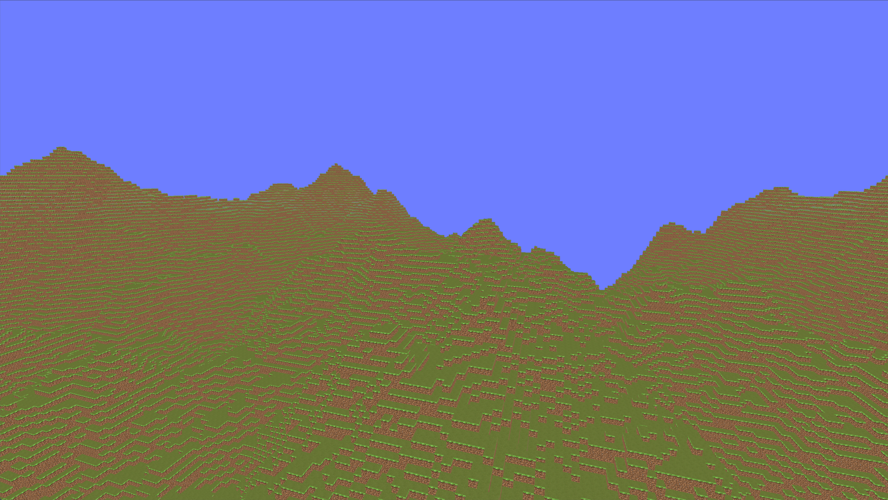

# 🧱 ft_vox

A Minecraft-like voxel engine written in **C++20** and **OpenGL**.

---

## 📸 Screenshot

> Add a screenshot here showing terrain rendering / chunks / wireframe mode



---

## 🚀 Overview

**ft_vox** is a prototype voxel engine focused on rendering large procedurally generated worlds using a chunk-based architecture.

The project explores:

- Efficient world streaming
- Custom memory layouts for voxel storage
- Real-time procedural terrain generation
- OpenGL rendering optimizations

It is currently in **early prototype stage**, with core systems implemented and major optimizations in progress.

---

## ✨ Features

🧩 Chunk-based world system (16×16×384)  
🧱 Vertical chunk sections (16×16×16)  
🌄 Procedural terrain generation (Perlin noise)  
🪨 Heightmap-based terrain shaping  
💡 Baked lighting system  
👁️ Back-face culling  
🧠 Custom 64-bit chunk hashing system  
🗺️ Unordered map-based chunk storage  
🧍 Floating origin system (precision-stable world)  
🎮 Fly camera (WASD + mouse look)  
🪟 Wireframe debug mode (toggle with `Z`)  
⚙️ Basic mesh optimization (face culling per chunk)

---

## 🧠 Planned Features

🚀 Greedy meshing (major performance upgrade)  
🧵 Thread pool for chunk generation & meshing  
📦 Chunk streaming system improvements  
🧍 Physics & collision system  
🧱 Block placement / breaking  
🌑 Advanced lighting (AO / shadows experiments)

---

## 🏗️ Project Structure

```block
├── glad/ # OpenGL loader
├── glm/ # Math library
├── include/ # Project headers
├── obj/ # Build objects
├── resources/ # Textures / assets
├── shaders/ # GLSL shaders
├── src/ # Source code
├── .clang-format
├── .gitignore
├── compile_commands.json
├── Makefile
└── ft_vox # Binary
```

---

## 🧱 World System

- World divided into **chunks (16×16×384)**
- Each chunk split into **24 vertical sections**
- Sections are **16×16×16 blocks**

This allows:

- Efficient meshing per region
- Partial updates
- Reduced memory overhead

---

## 🌍 Terrain Generation

Terrain is generated using multi-octave Perlin noise:

- Hills + mountain shaping
- Heightmap per chunk
- Layered block generation:
  - Bedrock (bottom layer)
  - Stone
  - Dirt
  - Grass (surface)

---

## 🧩 Chunk Storage

Chunks are stored in:

```cpp
std::unordered_map<uint64_t, Chunk>
```

Using a **custom bit-packed hash**:

- Encodes X and Z into a single 64-bit integer
- Enables fast lookup and spatial indexing

## 🎮 Controls

- `WASD` → Move
- Mouse → Look around
- `Z` → Toggle wireframe mode

The camera uses a **floating origin system**, meaning:

> The world moves around the player instead of the player moving through floating-point space

This prevents precision issues in large worlds.

---

## ⚙️ Build

### Compile

```bash
make
```

Run

```bash
./ft_vox
```

Clean

```bash
make clean
make fclean
```

---

## Dependencise

- GLFW

---

## 📊 Current Status

🟡 Prototype stage

Core systems implemented:

- Chunk system
- Terrain generation
- Rendering pipeline

Still in development:

- Meshing optimizations
- Multithreading system
- Gameplay systems (none yet)

---

## 🧠 Notes

This engine is built for experimentation with:

Low-level voxel storage design
Rendering performance techniques
Chunk streaming architecture
OpenGL pipeline control

---
